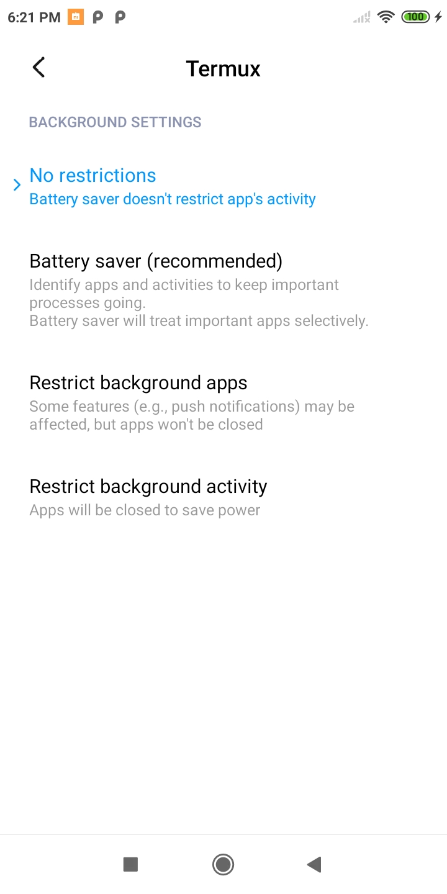
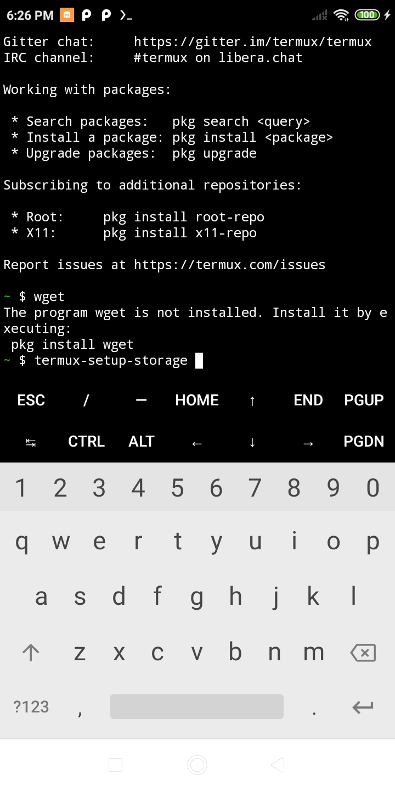

# Termux Android Scripts : Installation

This guide will walk you through the steps to install Termux and required scripts on your Android device using either adb tools or manual APK download.
You can check [Termux - the official web site here ](https://termux.dev/en/)
## Installation Steps

### 1. Install Termux and Termux:Boot
- You can download copies of apks here: [download link](https://github.com/kcommerce/Termux-Android-Scripts/tree/main/apk)
- Alternatively, you can download the latest version of Termux at [F-droid link](https://f-droid.org/en/)
- **Option 1: Using adb tools**
  - Ensure you have adb tools installed on your computer. You can find adb tools for macOS here: [download link](https://github.com/kcommerce/Termux-Android-Scripts/tree/main/adb-tools)
  - Connect your Android device to your computer via USB.
  - Run the following command to install Termux and Termux:Boot APKs:
    ```bash
    adb install path/to/Termux.apk
    adb install path/to/TermuxBoot.apk
    ```

- **Option 2: Manual APK Download**
  - Download the APK files for Termux and Termux:Boot manually to your phone.
  - Install the APKs on your Android device manually.

### 2. Set Autostart for Termux:Boot

- Open the Termux:Boot app on your device.
- Set up the autostart functionality as per the app's instructions.

### 3. Set Battery Permission to "No Restricted"

- Navigate to your device settings.
- Find the battery settings and set the permission for Termux to "No restrictions."
- Example Termux settings on Redmi 7A
- 
  
- For Termux:Boot , same like Termux
 
### 4. Launch Termux Application

- Locate and open the Termux application on your Android device.

### 5. Configure Termux

- Run the following commands in the Termux terminal to configure it:
  ```bash
  pkg install root-repo
  termux-setup-storage
  ```
- Example Termux terminal on Redmi 7A
-
  
### 6. Update and Upgrade Packages
- Run the following commands to update and upgrade Termux packages:
  ```bash
  pkg update -y
  pkg upgrade -y
  ```
### 7. Install Curl
- Run the following command to install curl:
  ```bash
  pkg install curl -y
  ```
### 8. Download and Run Installation Script
- Run the following commands to download and run the installation script:
  ```bash
  curl -o install.sh https://raw.githubusercontent.com/kcommerce/Termux-Android-Scripts/main/bin/install-base.sh
  chmod +x install.sh
  ./install.sh
The installation process will begin, and you'll be guided through the setup of the base Termux scripts.
